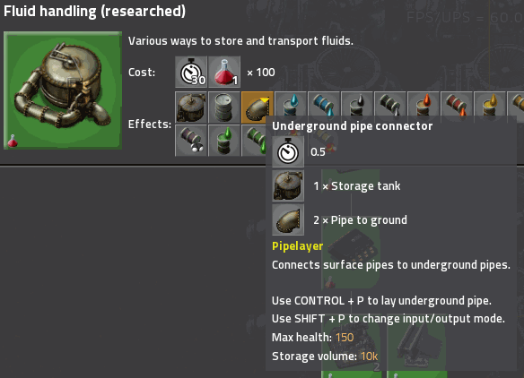
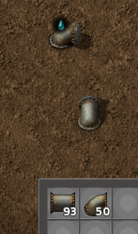
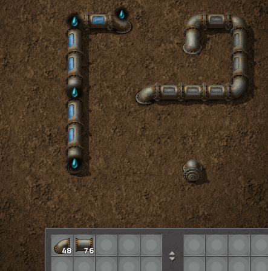
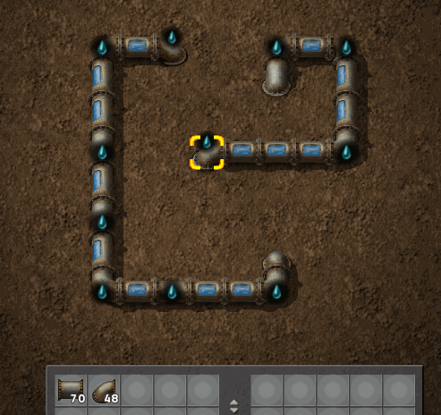
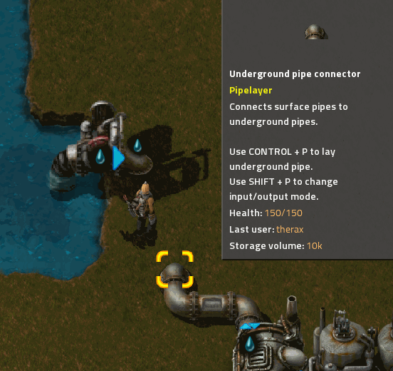
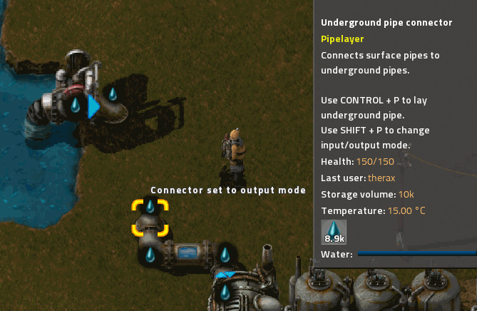
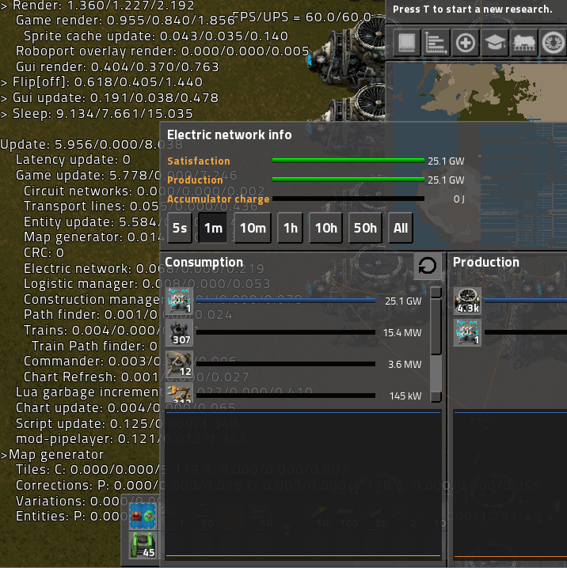

# Description

From the maker of [Beltlayer](https://mods.factorio.com/mod/beltlayer), we bring you Pipelayer.  Turn corners with your pipes, run them long distances, and save UPS along the way!

# How to use

1.  This mod introduces a new item, the Underground pipe connector, which unlocks with Fluid handling.

    

1.  Place down one next to each of your fluid producers, and another next to each of your fluid consumers.

1.  Press CONTROL-P to enter the editor view. (All keybinds are configurable.) You will find in your inventory all the regular pipe and pipe-to-ground items from your character inventory. You will also see the underground ends of your connectors. They can be freely rotated, and if you have already connected them to fluids aboveground, they shown what fluid they hold in the editor as well.

    

1.  Place pipes between the connectors. You can place and use regular pipe-to-ground to cross pipelines in the editor as usual. As you place pipes, you will see them fill.

    

    If you connect pipes with different fluids, all the pipes will empty to show that a conflict exists, and will not fill again until you fix the problem.

    

1.  Return to the overworld by pressing CONTROL-P again.

    

1.  Set the mode for each connector by pressing SHIFT-P.

    

    This is usually not necessary if you place the connectors directly next to buildings. When placed, connectors will attempt to determine whether they should act in input mode or output mode by looking at the connected building. This works for vanilla boilers/heat exchangers, steam engines/turbines, assemblers, oil refineries, pumps, etc. It does not work for buildings that can act as inputs or outputs, such as pipes, standard pipe-to-ground endpoints, storage tanks, etc.

    It does not currently work for modded buildings. This should be possible automatically in 0.17. I may also add support for popular mods on request, or add a remote API for mod authors to add support if there is interest in doing this.

1.  You should soon see fluid move from the input connectors to the output connectors.

# How it works

A set of connected underground pipes and connectors in the editor view is called a __network__.
Every network can handle one kind of fluid.  If a network includes two or more connectors with different kinds of fluids in them, the network is __in conflict__, and won't move any fluids.

The pipes in the editor view are not active entities, move no fluid, and consume no UPS. They only show the fluid handled by each network for convenience.  Instead, fluids are periodically moved directly from input connectors to output connectors on the same network by script.

Once every tick, each network searches its input connectors for one that has at least 2,500* fluid in it, and searches its output connectors for one that has room for at least 2,500* fluid.  If it finds one of each, it will transfer as much fluid as it can from the input to the output.  Each network will perform only one transfer each tick. If a network can't find an input connector and an ouput connector, it will go to sleep for 1* second to conserve UPS before checking again.

_\* Each of these parameters is adjustable via Mod settings._

# Caveats

Input connectors that have less than the _Transfer threshold_ will not send fluid. Similarly, output connectors that don't have enough room to meet the _Transfer threshold_ will not receive fluid. This is particularly noticable with storage tanks.

For example, if _Connector capacity_ is 10k and _Transfer threshold_ is 2.5k (the defaults), a storage tank connected to an output connector will not fill beyond 75%, because the connector will equalize with the storage tank and thus never go below 7.5k. This is usually not a concern, but if it is important that a particular tank be entirely filled, use a pump between the output connector and the storage tank.

# Performance Tuning

If you have a large network transferring a lot of fluid, you may need to adjust the settings to get maximum throughput while reducing UPS consumption. First consider increasing _Connector capacity_, which will increase the amount of buffered fluid in each network. You can then increase the _Transfer threshold_, which will reduce how often fluid is transferred, and allow the networks to go to sleep more often. Increasing _Connector capacity_ will also let you increase the _Update period_, which lets each network go to sleep for longer.

For example, in a test map with a typical (not UPS-optimized) 24 GW nuclear plant, I replaced 7.6k pipes and pipe-to-grounds with 3.3k pipelayer connectors and set _Transfer threshold_ to 7.5k. This reduced update time from 7.2 ms to 5.9 ms, of which script time was ~0.1 ms.

This is overall a 21% improvement in UPS from 135 to 160 UPS.  Most of the remaining time is consumed by steam turbines, heat exchangers, reactors, heat pipes, etc.  The improvement in pipe performance is more like 3x due to the reduction in active entities.  This is also a bit of a worst case scenario, given the large amount of fluid movement (water and steam) in this power plant.